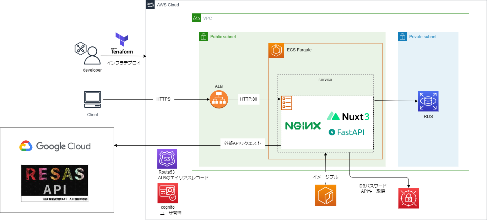

## パラメータシート
[READMEに戻る](../README.md)

### システム構成

### terraformパラメータ
terraform/envs/${stage}/main.tf  

| 変数名 | 説明 |
| -- | -- |
| terraform.bakend.s3.bucket | tfstateを管理S3バケット名 |
| terraform.bakend.s3.region | tfstateを管理S3バケットがあるリージョン |
| terraform.bakend.s3.key | tfstateファイルのパス |
| terraform.bakend.s3.encrypt | tfstateファイルを暗号化するか（trueでOK） |
| terraform.bakend.s3.dynamo_table | tfstateファイルのロック情報を管理するDynamoDBテーブル |
| provider.aws.region | リソースをデプロイするリージョン |
| locals.app_name | アプリ名 |
| locals.stage | ステージ名 |
| locals.vpc_cidr_block | リソースをデプロイするVPCのCIDR |

### terraformデプロイ実行時、入力待ちとなるパラメータ
*localsで管理したほうがいいものがないかチェックしておく  
terraform/envs/${stage}/environment.auto.tfvars
| 変数名 | 説明 |
| -- | -- |
| vpc_id | リソースをデプロイするVPCのid |
| private_subnets | RDSクラスタを配置するサブネット |
| db_user | DBのユーザー名 |
| db_password | DBのパスワード |
| cognito_userool_id | cognitoのユーザープールid |
| cognito_client_id | cognitoのアプリケーションクライアントid |
| find_place_url | google mapのfind place APIのURL |
| place_details_url | google mapのplace details APIのURL |
| find_place_api_key | google map APIのキー |
| photo_reference_url | google mapのphoto reference APIのURL |
| resas_api_prefecture_url | resas prefecture APIのURL |
| resas_api_city_url | resas city APIのURL |
| resas_api_key | resas APIのキー |
| front_app_image_uri | フロントエンドのコンテナイメージのURI |
| api_app_image_uri | バックエンドエンドのコンテナイメージのURI |
| nginx_app_image_uri | nginxコンテナイメージのURI |
| public_subnets | ALB, ECSを配置するプライベートサブネット |
| hostzone_id | ALBのエイリアスレコードを管理するホストゾーンのid |
| hostzone_name | ALBのエイリアスレコードを管理するホストゾーンの名前 |
| certificate_arn | アプリで使用するドメインの証明書（ACM）のARN |

## Cognito ユーザープールパラメータ
### 認証プロバイダ

| 設定項目 | 値 |
| -- | -- |
| プロバイダのタイプ | Cognitoユーザープール |
| Cognito ユーザープールのサインインオプション | ユーザー名 |
| ユーザー名の要件 | 有効化しない |

### パスワードポリシー
| 設定項目 | 値 |
| -- | -- |
| パスワードポリシー | Cognitoのデフォルト |

### 多要素認証
| 設定項目 | 値 |
| -- | -- |
| MFAの強制 | MFAなし |

### ユーザーアカウントの復旧
| 設定項目 | 値 |
| -- | -- |
|セルフサービスのアカウントの復旧 | 有効化しない |

### セルフサービスのサインアップ
| 設定項目 | 値 |
| -- | -- |
| 自己登録 | 自己登録を有効化 |

### 属性検証とユーザーアカウントの確認
| 設定項目 | 値 |
| -- | -- |
| Cognito アシスト型の検証および確認 | 自動的に送信：Cognito が検証と確認のためにメッセージを自動的に送信することを許可  検証する属性：E メールのメッセージを送信、E メールアドレスを検証 |
| 属性変更の確認  | 未完了の更新があるときに元の属性値をアクティブに保つ：有効化しない |

### 必須の属性
| 設定項目 | 値 |
| -- | -- |
| 追加の必須属性 | email |

### Eメール
| 設定項目 | 値 |
| -- | -- |
| Eメールプロバイダー | CognitoでEメールを送信 |
| 返信先Eメールアドレス | 指定しない |

### ユーザープール名
| 設定項目 | 値 |
| -- | -- |
| ユーザープール名 | 任意の値を入力 |

### ホストされた認証ページ
| 設定項目 | 値 |
| -- | -- |
| Cognito のホストされたUIを使用 | 有効化しない |

### 最初のアプリケーションクライアント
| 設定項目 | 値 |
| -- | -- |
| アプリケーションタイプ | パブリッククライアント |
| アプリケーションクライアント名 | 任意の値を入力 |
| クライアントシークレット | クライアントのシークレットを生成しない |

### 高度なアプリケーションクライアントの設定
デフォルトを使用

### 属性の読み取りおよび書き込み許可
デフォルトを使用
